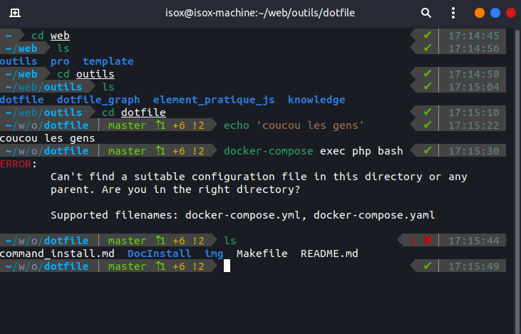

# Custom Terminal avec Oh-my-zsh

[](https://raw.githubusercontent.com/theomeunier/dotfile/master/img/custom_terminal.png)


## Installation et configuration de ZSH

### 1 - Installation 

L'installation de Oh My Zsh peut être effectuée en utilisant les commandes "Curl" ou "Wget" dans votre terminal. Assurez-vous que l'un ou l'autre des utilitaires est installé dans le système d'exploitation, sinon installez-les avec git en exécutant la commande apt suivante.

```shell
sudo apt install curl wget git
sudo apt install zsh -y
```

- Pour mettre a jour les modifications 
```shell
source ~/.zshrc
```

## Installation Oh-my-zsh
```shell
sh -c "$(curl -fsSL https://raw.github.com/ohmyzsh/ohmyzsh/master/tools/install.sh)"
```

## Installation de Power Level 10K (thème)

### 1 - Installation

```shell
git clone https://github.com/romkatv/powerlevel10k.git $ZSH_CUSTOM/themes/powerlevel10k
```

### 2 - Configuration

- Modifier la ligne `ZSH_THEME`

```shell
sudo nano ~/ .zshrc 
ZSH_THEME="powerlevel10k/powerlevel10k"
```
- Lancer la configuration 
```shell
p10k configure
```

## Installation plugin

### 1 - Installation des plugins via git
- zsh-autosuggestions
```shell
git clone https://github.com/zsh-users/zsh-autosuggestions ~/.oh-my-zsh/custom/plugins/zsh-autosuggestions
```
- zsh-syntax-highlighting
```shell
git clone https://github.com/zsh-users/zsh-syntax-highlighting.git ~/.oh-my-zsh/custom/plugins/zsh-syntax-highlighting
```
### 2 - configuration des plugins

Ajouter la ligne ci-dessous dans `.zshrc`

```shell
sudo nano ~/ .zshrc 
plugins=(git zsh-autosuggestions zsh-syntax-highlighting)
```