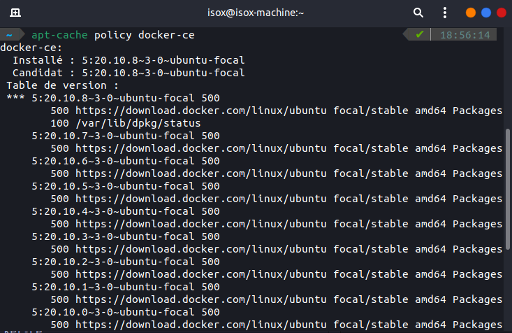
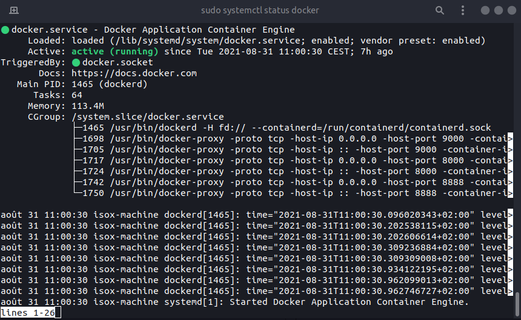

# Installation docker et portainer

### 1 - Mettre à jour les packages existante
```shell
sudo apt update
```

### 2 - Installez quelques paquets pré-requis qui permettent à apt d'utiliser les paquets sur HTTPS
```shell
sudo apt install apt-transport-https ca-certificates curl software-properties-common
```

### 3 - Ajoutez la clé GPG du dépôt officiel de Docker à votre système
```shell
curl -fsSL https://download.docker.com/linux/ubuntu/gpg | sudo apt-key add -
```

### 4 - Ajoutez le référentiel Docker aux sources APT
```shell
sudo add-apt-repository "deb [arch=amd64] https://download.docker.com/linux/ubuntu focal stable"
```

### 5 - Mettre à jour les packages
```shell
sudo apt update
```

### 6 - Assurez-vous que vous êtes sur le point d'installer à partir du dépôt Docker et non du dépôt Ubuntu par défaut
```shell
sudo apt-cache policy docker-ce
```
[](https://raw.githubusercontent.com/theomeunier/dotfile/master/img/docker_policy.png)

### 7 - Installation docker
```shell
sudo systemctl status docker
```

### 8 - Vérifier l'installation docker
```shell
sudo systemctl status docker
```
[](https://raw.githubusercontent.com/theomeunier/dotfile/master/img/confim_install_docker.png)

### 9 - Donner les droits admin à docker
```shell
sudo usermod -aG docker ${USER}
su - ${USER}
id -nG
```

## Installtion docker-compose

### 1 - Installtion
```shell
sudo curl -L "https://github.com/docker/compose/releases/download/1.26.0/docker-compose-$(uname -s)-$(uname -m)" -o /usr/local/bin/docker-compose

sudo chmod +x /usr/local/bin/docker-compose

sudo ln -s /usr/local/bin/docker-compose /usr/bin/docker-compose
```

### 2 - Vérifier que docker-composer est bien installer
```shell
docker-compose --version
```

## Installtion portainer

### 1 - Crée un volume docker
```shell
docker volume create portainer_data
```

### 2 - Lancer le container docker
```shell
docker run -d -p 8000:8000 -p 9000:9000 --name=portainer --restart=always -v /var/run/docker.sock:/var/run/docker.sock -v portainer_data:/data portainer/portainer
```