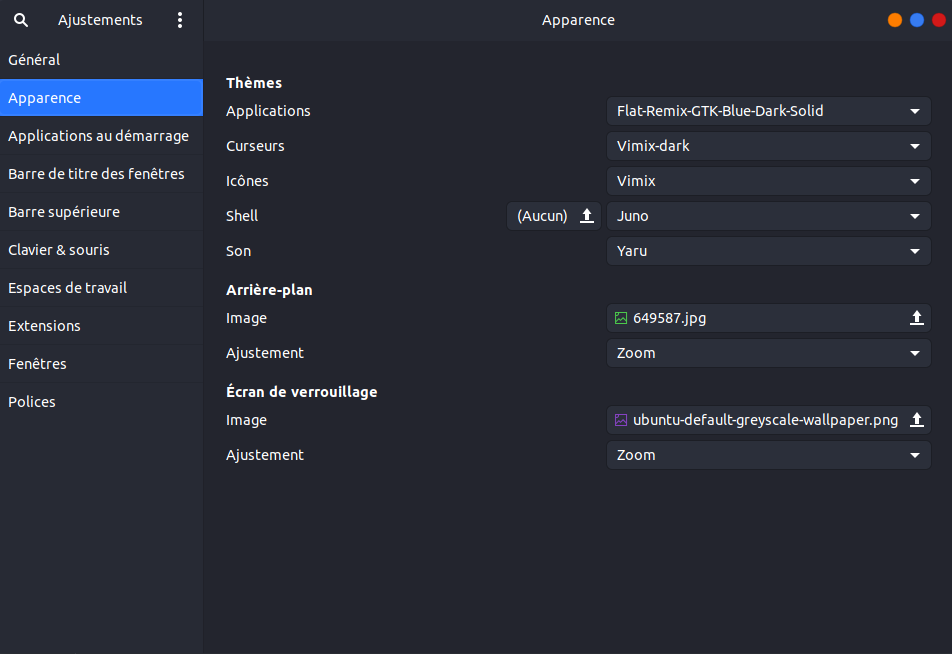

# Config ubuntu 21.04

## Logiciel et Outils
### Logiciel            
- Toolbox
- Vscode
- Insomnia
- Nextcloud
- Teamviewer
- Discord
- Spotify
- Bitwarden

### Outils

- php 8.0
- Composer
- Nodejs (npm yarn)
- Docker (portainer)
- git
- Maker

## Théme

### Pour le Théme de L'OS: 

### Pour le Terminal:
 - Oh_my_zsh 
   - power level 10K
   - zsh-autosuggestion
   - zsh-syntax-highligting

### Phpstrom

- TokyoNight (https://github.com/Grafikart/tokyo-night-jetbrains-theme)
- Atom Material Icon 
- Material Theme

