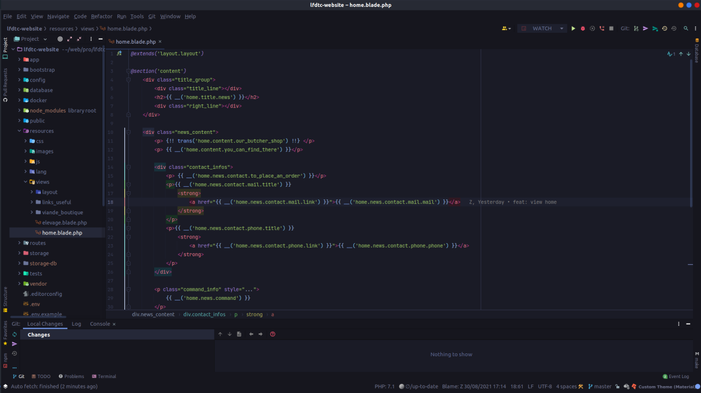

# My dotfile

## What's in this setup?

- Terminal: Windows Terminal / Wrap
- Zsh
- Git
- Docker
- Docker compose
- Node js (using mvn)
- IDE: Jetbrains (Phpstrom, IntelliJ IDEA), Visual Studio

## Setup WSL

```powershell 
dism.exe /online /enable-feature /featurename:Microsoft-Windows-Subsystem-Linux /all
dism.exe /online /enable-feature /featurename:VirtualMachinePlatform /all

wsl --set-default-version 2
```

## Install ZSH 

### On My Zsh
```shell
sh -c "$(curl -fsSL https://raw.github.com/ohmyzsh/ohmyzsh/master/tools/install.sh)"
```

### P10k
```shell
git clone https://github.com/romkatv/powerlevel10k.git $ZSH_CUSTOM/themes/powerlevel10k
p10k configure

git clone https://github.com/zsh-users/zsh-autosuggestions ~/.oh-my-zsh/custom/plugins/zsh-autosuggestions
git clone https://github.com/zsh-users/zsh-syntax-highlighting.git ~/.oh-my-zsh/custom/plugins/zsh-syntax-highlighting
```

## Install NVM
```shell
curl https://raw.githubusercontent.com/creationix/nvm/master/install.sh | bash 
source ~/.nvm/nvm.sh

nvm install --lts 
```

## Thème

### L'OS: 

[](https://raw.githubusercontent.com/theomeunier/dotfile/master/img/ajustement_config.png)

### Phpstrom

- Catpussin Theme (https://github.com/catppuccin/catppuccin)
- Atom Material Icon 
- Material Theme

[](https://raw.githubusercontent.com/theomeunier/dotfile/master/img/theme_phpstrom.png)
